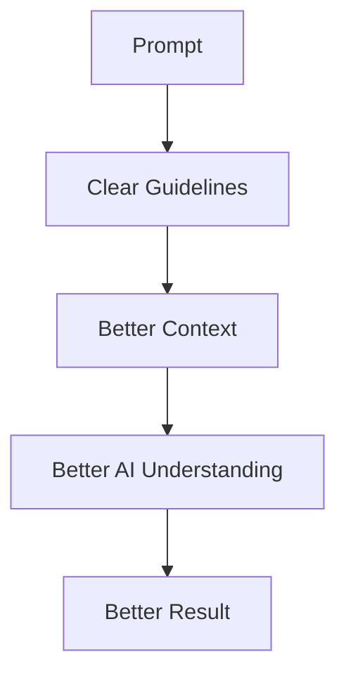
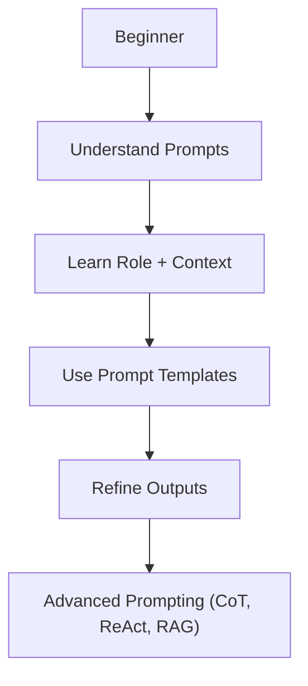

# Prompt Engineering for Beginners

## Table of Contents

1. [Introduction](#introduction)
2. [What Is an AI Prompt? (With Examples)](#what-is-an-ai-prompt-with-examples)
3. [Why Prompt Quality Matters](#why-prompt-quality-matters)
4. [Bad vs Good vs Best Prompt: Real Examples](#bad-vs-good-vs-best-prompt-real-examples)
5. [The Formula Behind Great Prompts](#the-formula-behind-great-prompts)
6. [Types of Context: How Context Makes You a Power User](#types-of-context-how-context-makes-you-a-power-user)
7. [Types of Output Format: Choosing the Right Structure](#types-of-output-format-choosing-the-right-structure)
8. [What to Add and Avoid for Pro-Level Prompts](#what-to-add-and-avoid-for-pro-level-prompts)
9. [File Attachment & RAG: Grounding AI in Real Documents](#file-attachment--rag-grounding-ai-in-real-documents)
10. [Power Keywords That Improve AI Outputs](#power-keywords-that-improve-ai-outputs)
11. [Prompt Quality vs Output Quality](#prompt-quality-vs-output-quality)
12. [Sector-Wise Prompt Cheat Sheet](#sector-wise-prompt-cheat-sheet)
13. [5 Prompt Strategies Every Beginner Should Learn](#5-prompt-strategies-every-beginner-should-learn)
14. [Common Prompt Mistakes Beginners Make](#common-prompt-mistakes-beginners-make)
15. [Copy-and-Paste Prompt Template](#copy-and-paste-prompt-template)
16. [Your Prompt Engineering Roadmap](#your-prompt-engineering-roadmap)
    - [Overcoming AI's Knowledge Cutoff](#overcoming-ais-knowledge-cutoff)
17. [FAQ: Frequently Asked Questions](#faq-frequently-asked-questions)
18. [Final Thoughts](#final-thoughts)

---

## Introduction

AI tools like ChatGPT, Gemini, Claude, and Copilot are incredibly powerful.

Yet something interesting happens every day:

Two people can use the exact same AI tool and get completely different results.

One person produces high-quality content, professional emails, marketing campaigns, business plans, or software code.

The other receives generic, vague, or disappointing responses.

**Why?**

The difference often comes down to one thing: **the quality of the prompt.**

Many people think AI is simply about asking questions. In reality, working with AI is much like working with a skilled assistant. The clearer your guidelines, the better the outcome.

In this guide, you'll learn:

- What a prompt is
- Why prompt quality matters
- The difference between bad, good, and great prompts
- A simple prompt-writing framework
- Powerful keywords that improve AI outputs
- Industry-specific prompt examples
- Practical prompt strategies anyone can use

---

## What Is an AI Prompt? (With Examples)

In simple terms:

> A prompt is any direction you give to an AI system.

Everything you type into ChatGPT, Gemini, Claude, or another AI tool is a prompt.

For example:

```text
Write a blog about freelancing.
```

This is a prompt. So is this:

```text
Act as a Senior Content Writer.

Write a beginner-friendly 1,000-word blog about freelancing.

Use simple language.

Include real-world examples.

Format the article in Markdown.
```

Both are prompts. However, the results will be dramatically different.

---

## Why Prompt Quality Matters

AI cannot read your mind. It can only work with the information you provide.

Imagine telling a taxi driver:

> "Take me to a restaurant."

The driver immediately faces several questions:

- What type of restaurant?
- Italian?
- Japanese?
- Fast food?
- Fine dining?
- Budget-friendly?

Without enough information, the driver must make assumptions.

AI works exactly the same way.

If you write:

```text
Write a blog about marketing.
```

The AI has to guess:

- Who is the audience?
- What type of marketing?
- How long should it be?
- What tone should it use?

But if you write:

```text
Write a beginner-friendly 1,000-word blog about digital marketing for
small business owners. Use simple language and include real-world
examples.
```

The AI now has clear guidelines. As a result, the response becomes more relevant, useful, and professional.

Simply put:

> **Better Instructions = Better Results**

### How Better Prompts Create Better Results



---

## Bad vs Good vs Best Prompt: Real Examples

### Example 1: Content Writing (Digital Marketing)

**Bad Prompt**

```text
Write about digital marketing.
```

**Problems:**

- No audience
- No goal
- No format
- No length
- No context

**Result:** Basic, generic response.

**Good Prompt**

```text
Write a blog about digital marketing for small business owners.
```

This is better because it provides an audience. However, many important details are still missing.

**Best Prompt**

```text
Act as a Senior Digital Marketing Consultant.

Write a 1,200-word beginner-friendly blog for small business owners.

Explain:
- SEO
- Social Media Marketing
- Email Marketing

Use simple language.

Include practical examples.

Format the article in Markdown.
```

> **Context check:** "for small business owners" is the context — it tells the AI exactly who will read this, which shapes the tone, depth, and examples it chooses.
>
> **Format check:** "Format the article in Markdown" is the output format — it tells the AI to return proper headings and structure instead of one long block of text.

Now the AI knows:

- Its role
- The audience
- The objective
- The writing style
- The desired format

The result is far more targeted and professional.

### Example 2: Everyday Task (Email Writing)

**Bad Prompt**

```text
Write an email to my boss.
```

**Good Prompt**

```text
Write a polite email to my boss asking for two days of leave.
```

**Best Prompt**

```text
Act as a Professional Communication Coach.

Draft a polite, concise email to my manager requesting two days of
leave next week for a family event.

Tone: Respectful and brief.

Keep it under 100 words.

Output Format: Plain email text with subject line.
```

> **Context check:** "requesting two days of leave next week for a family event" is the context — it gives the AI the exact reason and timing, so the email doesn't sound like a generic template.
>
> **Format check:** "Output Format: Plain email text with subject line" tells the AI exactly what shape to deliver — ready to copy and send, instead of a description of what the email should contain.

### Example 3: Software Development (Coding)

**Bad Prompt**

```text
Fix my code.
```

**Good Prompt**

```text
Fix the bug in this Python function.
```

**Best Prompt**

```text
Act as a Senior Software Engineer.

Review the Python function below, identify the bug causing incorrect
output, and explain the fix.

Constraints:
- Keep the solution under 15 lines.
- Do not change the function name.

Output Format: Corrected code block followed by a one-line explanation.
```

> **Context check:** "the Python function below" plus the pasted code itself is the context — this is Data Context in action, giving the AI real material to work with instead of a vague description.
>
> **Format check:** "Output Format: Corrected code block followed by a one-line explanation" forces a Code Format response — directly runnable, instead of a paragraph describing the fix.

Across all three examples, the pattern repeats: vague input creates basic output, while a structured, detailed prompt leverages the AI's full capability and delivers a professional, ready-to-use result.

---

## The Formula Behind Great Prompts

Most effective prompts contain five key elements:


### The 5 Building Blocks of a Great Prompt

**1. Role**

Tell the AI who it should be.

Examples:

- Act as a Career Coach.
- Act as a Senior Copywriter.
- Act as a Data Analyst.

**2. Context**

Provide background information — the situation, audience, and details the AI needs to understand *why* you're asking, not just *what* you're asking.

"Background information" is broader than it sounds. It can include who you are, what data you're working with, or what stage your task is currently at. See the [Types of Context](#types-of-context-how-context-makes-you-a-power-user) section below for a full breakdown.

Examples:

- I am applying for a remote job.
- I am launching a new SaaS startup.

**3. Task**

Specify what you want the AI to do.

Examples:

- Write
- Analyze
- Research
- Audit
- Create
- Explain
- Summarize

**4. Constraints**

Define limitations and rules.

Examples:

- Avoid jargon.
- Do not use technical language.
- Keep the article under 500 words.

**5. Output Format**

Tell the AI how to present the answer — the shape of the deliverable, not just its content.

Without a specified format, the AI defaults to a generic paragraph, even when a table, checklist, or code block would be far more usable. See the [Types of Output Format](#types-of-output-format-choosing-the-right-structure) section below for a full breakdown.

Examples:

- Markdown
- Table
- JSON
- Checklist
- Bullet Points

---

## Types of Context: How Context Makes You a Power User

Most beginners think of context as a single sentence, like "I am launching a new SaaS startup." In reality, context comes in several distinct types, and combining them is what separates a casual user from a power user.

### 1. User Context (Who You Are)

Information about your identity, role, or situation that shapes how the AI should respond.

```text
I am a first-time founder with no marketing background.
```

### 2. Data Context (What You're Working With)

The actual material the AI needs to process — a paragraph, a spreadsheet row, an API response, or a code snippet. This is more powerful than describing your situation in words, because the AI works directly with real data instead of your summary of it.

```text
Here is my current resume content:
"""
[Paste resume text here]
"""
```

### 3. Task Context (Where the Project Currently Stands)

The current state, history, or stage of the work — what's already been done, and what stage you're at now.

```text
I already wrote the introduction and conclusion. I only need help
with the middle three paragraphs.
```

### Next-Level Technique: Pasting Real Data as Context

Beyond one-line descriptions, you can paste entire blocks of real material directly into your prompt as context. This is one of the most underused techniques by beginners:

- **A document or article** — paste the full text and ask the AI to summarize, rewrite, or extract from it
- **A code snippet** — paste a function or error log and ask the AI to debug or refactor it
- **A JSON schema or spreadsheet data** — paste raw data and ask the AI to reformat, analyze, or validate it
- **A website reference or URL content** — paste copied page text and ask the AI to compare or evaluate it

```text
Act as a Data Analyst.

Context (raw data):
"""
Name, Revenue, Region
Alpha Corp, 42000, North
Beta Inc, 31000, South
Gamma LLC, 58000, East
"""

Task:
Identify the top-performing region and explain why in two sentences.

Output Format: Bullet points.
```

The result of feeding real data as context is dramatically more accurate and useful than describing the data in your own words — the AI works with facts instead of your interpretation of them.

---

## Types of Output Format: Choosing the Right Structure

Just like context, "format" is not a single setting — it's a choice between several distinct structures, and picking the right one determines whether you get a usable deliverable or a wall of text you still have to reformat yourself.

### 1. Prose Format (Paragraphs)

Best for explanations, stories, emails, and content meant to be read top to bottom.

```text
Output Format: Two short paragraphs, no headings.
```

### 2. List Format (Bullet Points or Numbered Steps)

Best for instructions, summaries, or anything with multiple distinct items.

```text
Output Format: Numbered steps, one action per line.
```

### 3. Table Format

Best for comparisons, data with multiple attributes, or anything readers need to scan quickly.

```text
Output Format: Table with columns "Option," "Pros," "Cons."
```

### 4. Structured Data Format (JSON / XML / CSV)

Best when the output will be fed into another tool, app, or script rather than read directly by a person.

```text
Output Format: Valid JSON array with keys "name," "role," "email."
No extra text outside the JSON.
```

### 5. Code Format

Best for technical tasks — the AI returns a ready-to-run code block instead of a description of code.

```text
Output Format: A single Python code block, no explanation outside it.
```

### Why the Right Format Matters

Choosing the correct format saves real time. A comparison stuffed into a paragraph forces you to re-read it three times; the same comparison in a table takes five seconds to scan. A data response without a JSON instruction often comes wrapped in extra sentences that break your script when you try to parse it. Matching the format to how the output will actually be used is what turns an AI response into something you can use immediately, with zero cleanup.

---

## What to Add and Avoid for Pro-Level Prompts

Beyond Role, Context, Task, Constraints, and Format, a few extra habits separate a pro-level prompt engineer from a casual user.

### Power Techniques to Add

**Guardrails / Negative Constraints**

Tell the AI not just what to do, but what to never do. This single addition prevents most of the AI's worst habits — guessing at facts, drifting into jargon, or padding the response with filler.

```text
Do not invent facts you are not certain about. If you don't know
something, say "I don't have enough information."

Do not use technical jargon — explain it as if I am a complete beginner.
```

**Few-Shot Examples**

Before assigning the task, give the AI 2–3 real input-output examples. This single technique can improve output quality dramatically, because the AI mirrors the exact pattern you demonstrate instead of guessing at your expectations.

```text
Here are two examples of the tone I want:

Input: "Our product launched today."
Output: "Big news — our product just went live, and we couldn't be
more excited to share it with you."

Input: "We fixed a bug in the app."
Output: "We squashed a pesky bug, so your app experience just got
a little smoother."

Now write a similar update for: "We added a new dashboard feature."
```

### Mistakes to Avoid

**Open-Ended / Vague Words**

Avoid soft, subjective instructions like "make it nice" or "fix the code." The AI has no fixed definition of "nice." Replace vague words with specific, measurable instructions.

```text
Vague:  Make the message nice.
Better: Make the message sound professional and friendly. Keep it
        under 100 words and avoid exclamation marks.
```

**Overloading Instructions**

Don't stack 10–15 complex conditions into a single prompt. The AI starts dropping or blending requirements when too many compete for attention at once. Instead, work iteratively — get one part right, then refine in the next message.

```text
Overloaded: One prompt asking for tone, length, SEO keywords, three
            CTAs, a table, a summary, and five FAQs all at once.

Iterative:  Step 1 — Draft the core content.
            Step 2 — "Now adjust the tone to be more persuasive."
            Step 3 — "Now add an FAQ section based on this draft."
```

---

## File Attachment & RAG: Grounding AI in Real Documents

Modern AI tools — ChatGPT, Claude, Gemini — let you upload a file directly instead of typing or pasting its contents. For a prompt engineer, this is a must-know skill, and it's the practical, hands-on version of the [RAG](#overcoming-ais-knowledge-cutoff) technique covered in detail later in this guide.

### What You Can Upload as a File

- Text documents (`.txt`, `.pdf`, `.docx`)
- Spreadsheets and structured data (`.csv`, `.json`)
- Images and screenshots
- Source code files

### Why This Matters

**Zero Hallucination**

Instead of generating answers from its own memory, the AI reads directly from your file's ground-truth data. This sharply reduces the risk of the AI inventing facts, numbers, or details that don't actually exist.

**Customized Knowledge**

Upload your company's policy document, a past work sample, or a sales spreadsheet, and the AI tailors its response to that exact material — producing precise, real-time answers instead of generic, one-size-fits-all advice.

**Massive Context**

Instead of pasting long text by hand, you can feed an entire dataset or documentation file into the AI instantly — no copy-paste, no truncation, no manual summarizing on your end.

```text
Act as a Compliance Officer.

I've attached our company's refund policy document.

Task:
Answer customer questions strictly based on the attached policy.
If the answer isn't in the document, say "This isn't covered in our
current policy."

Output Format: Plain text, 2-3 sentences per answer.
```

### Pro-Tip: Pair File Attachments With Guardrails

A file alone isn't enough — always combine it with a [Negative Constraint](#what-to-add-and-avoid-for-pro-level-prompts) so the AI doesn't fill in gaps with guesses when the file's data is incomplete.

```text
Analyze this attached CSV data. Avoid making assumptions if data is
missing; instead, output "Data Unavailable."
```

---

## Power Keywords That Improve AI Outputs

Certain words can significantly improve the quality of AI-generated content.

| Category | Keywords |
|----------|----------|
| **Authority Keywords** | Senior, Expert, Professional, Specialist, Consultant, Lead |
| **Action Keywords** | Create, Analyze, Research, Audit, Summarize, Refactor |
| **Accuracy Keywords** | Step-by-step, Detailed, Evidence-based, Data-driven |
| **Restriction Keywords** | Avoid, Never, Exclude, Do Not, Without |
| **Formatting Keywords** | Markdown, JSON, Checklist, Table, Bullet Points |

---

## Prompt Quality vs Output Quality

> *Note: You can add a chart/infographic for this section (as an image in WordPress or Notion). Suggested alt text: "Comparison of bad vs good vs best AI prompts and their output quality."*

**Concept:**

```text
Basic Prompt    → Basic Result
Improved Prompt → Better Result
Advanced Prompt → Professional Deliverable
```

---

## Sector-Wise Prompt Cheat Sheet

Each role below works best when paired with a full prompt, not just the role itself. Use these as ready-to-apply templates.

### Content Writing

```text
Act as a Senior Content Writer.
Draft a beginner-friendly blog post about [topic].
Use simple language and a conversational tone.
Keep it under 800 words.
```

```text
Act as a Blog Editor.
Review this draft for clarity, flow, and grammar.
Suggest improvements without changing the core message.
```

```text
Act as a Storytelling Expert.
Turn this list of facts into a short, engaging narrative.
Output Format: 3 short paragraphs.
```

### Marketing

```text
Act as a Growth Marketer.
Create 5 ad headlines for [product] targeting [audience].
Keep each headline under 10 words.
```

```text
Act as a Brand Strategist.
Analyze this brand description and suggest 3 positioning angles.
Output Format: Bullet points.
```

```text
Act as a Performance Marketing Expert.
Audit this ad copy and recommend changes to improve click-through rate.
```

### Software Development

```text
Act as a Senior Software Engineer.
Refactor this function for readability and performance.
Avoid changing its external behavior.
```

```text
Act as a Code Reviewer.
Review this pull request for bugs, security issues, and style violations.
Output Format: Numbered list of findings.
```

```text
Act as a System Architect.
Design a high-level architecture for [project type].
Output Format: Diagram description plus a short explanation.
```

### Education

```text
Act as a Tutor.
Explain [concept] as if I am a complete beginner.
Use a real-world analogy.
Keep the explanation under 200 words.
```

### Research

```text
Act as a Research Analyst.
Summarize the key findings from [topic/source] in plain language.
Output Format: Bullet points with sources cited.
```

```text
Act as an Industry Expert.
Compare [Option A] and [Option B] for [use case].
Output Format: Table with pros and cons.
```

### Business

```text
Act as a Startup Consultant.
Evaluate this business idea for market viability.
Identify 3 risks and 3 opportunities.
```

```text
Act as a Business Strategist.
Create a 90-day growth plan for [business type].
Output Format: Markdown checklist.
```

---

## 5 Prompt Strategies Every Beginner Should Learn

**Strategy 1: Ask for Step-by-Step Explanations**
```text
Explain step-by-step.
```

**Strategy 2: Request Examples**
```text
Give 3 real-world examples.
```

**Strategy 3: Let AI Interview You**
```text
Before answering, ask me questions one by one.
```

**Strategy 4: Force a Structure**
```text
Use:
- Introduction
- Main Points
- Conclusion
```

**Strategy 5: Improve Existing Output**
```text
Improve this response by 30%.

or

Make this more persuasive.

or

Make this sound more professional.
```

---

## Common Prompt Mistakes Beginners Make

- **Vague Instructions** — soft, subjective phrases like "make the message nice" or "fix the code" give the AI no fixed target to aim for. Replace them with specific, measurable instructions instead, such as "make it sound professional and keep it under 100 words." See [Mistakes to Avoid](#what-to-add-and-avoid-for-pro-level-prompts) for more examples.
- Not specifying the audience
- **Forgetting the desired format** — without a format instruction, the AI defaults to a generic paragraph regardless of what the output is actually for. A comparison you needed as a table arrives as a dense block of text; structured data you needed as JSON arrives wrapped in extra sentences that break your script. You end up doing the reformatting work the AI should have done for you.
- **Not providing enough context** — this is the most damaging mistake on this list. Without context, the AI has no idea who the response is for or why it's needed, so it defaults to generic phrasing and safe, surface-level statements. The result reads as robotic, repetitive, and disconnected from your actual situation — even if the grammar and structure look fine.
- Skipping the role definition
- Accepting the first draft without refinement
- Using one-shot prompts for complex tasks
- **Overloading Instructions** — stacking 10–15 complex conditions into a single prompt backfires. The AI starts forgetting or blending requirements when too many compete for attention at once. Break the task into smaller, iterative steps instead, refining one piece at a time across multiple messages.
- **Relying on AI for recent events without giving it search or source access** — asking about current news, prices, or releases without enabling web search or pasting source material forces the AI to answer from its training data, which may be outdated or simply wrong. See [Overcoming AI's Knowledge Cutoff](#overcoming-ais-knowledge-cutoff) for how to fix this.

---

## Copy-and-Paste Prompt Template

```text
Act as a [Role].

Context: [Who you are / the data you're working with / the current stage of the task]

Task:
[What should the AI do?]

Requirements:
- Requirement 1
- Requirement 2
- Requirement 3

Avoid:
- Thing 1
- Thing 2

Output Format:
[Markdown / Table / JSON / Bullets]
```

---

## Your Prompt Engineering Roadmap



Once you're comfortable with the basics, you can explore advanced techniques:

- **CoT (Chain of Thought):** Asking the AI to "think step-by-step" before answering, which improves accuracy on math and logic tasks.
- **ReAct (Reason and Act):** A technique where the AI reasons, takes an action like a web search, then evaluates the result in a loop until it reaches an answer.
- **RAG (Retrieval-Augmented Generation):** Grounding AI responses in your own documents or data instead of relying only on its training knowledge.

### Bonus Tips for Sharper Advanced Results

Two small additions push any of the techniques above even further:

- **Negative Constraints:** Tell the AI what it should *never* do, alongside the task itself — for example, "Do not invent facts you're not certain about." This single line prevents most hallucination and jargon issues. Full breakdown in [What to Add and Avoid](#what-to-add-and-avoid-for-pro-level-prompts).
- **Few-Shot Examples:** Show the AI 2–3 real input-output samples before assigning the task, so it mirrors your exact pattern instead of guessing at it. Full breakdown in [What to Add and Avoid](#what-to-add-and-avoid-for-pro-level-prompts).

### Overcoming AI's Knowledge Cutoff

Every AI model has a training cutoff date, so it has no built-in memory of events after that point. Beginners often assume the AI "just knows" the latest news, prices, or releases — it doesn't, unless you give it a way to find that information. Here's how to get current, accurate answers instead of outdated guesses.

**1. Use RAG: Paste the Recent Article as Data Context**

Instead of asking the AI to answer from its own memory, copy the text of a recent news article or webpage directly into your prompt as [Data Context](#types-of-context-how-context-makes-you-a-power-user). The AI then reasons over the real, current text instead of an outdated internal snapshot.

```text
Act as a News Analyst.

Context (pasted article):
"""
[Paste the full text of the recent article here]
"""

Task:
Based only on the article above, summarize the three most important
updates in plain language.

Output Format: Bullet points.
```

**2. Activate Live Web Browsing**

If your AI tool supports live internet search (most modern tools do), explicitly instruct it to search instead of relying on memory. A direct command at the start of the prompt is what actually triggers this behavior.

```text
Search the web for the latest updates on [topic] before answering.
Cite the source of each claim.
```

**3. Fix the Time-Frame Inside the Prompt**

AI models can lose track of "now" since they don't have a built-in clock. State the current date directly in your context so the AI doesn't reason from a stale internal assumption about what month or year it is.

```text
Context: Today is June 2026. Treat any information from before this
date as potentially outdated.
```

**4. Add a "No-Guessing" Guardrail**

Combine the techniques above with a strict negative constraint so the AI refuses to fabricate an answer when it genuinely doesn't have current information — instead of hallucinating a plausible-sounding but false one.

```text
If you don't have verified, current information on this topic, say
"Data Unavailable" instead of guessing.
```

Used together, these four techniques are what actually overcome an AI's knowledge cutoff — RAG and file context supply the missing facts, web search fills real-time gaps, the time-frame anchor keeps reasoning current, and the no-guessing guardrail stops hallucination when none of the above is enough.

---

## FAQ: Frequently Asked Questions

**What is the best AI prompt formula?**

The most reliable formula combines five elements: Role + Context + Task + Constraints + Format. Together, they remove ambiguity and guide the AI toward a precise, professional result.

**What is the difference between a good prompt and a bad prompt?**

A bad prompt is vague and missing context, audience, or format — forcing the AI to guess. A good prompt adds some of these details. A best prompt includes all five building blocks, producing a far more targeted response.

**How do I write a prompt for ChatGPT as a beginner?**

Start by defining a role for the AI, explain your context, state the task clearly, add any constraints, and specify your preferred output format. The Copy-and-Paste Prompt Template above is a good starting point.

**Do I need to learn advanced techniques like CoT or RAG as a beginner?**

No. Beginners should first master the 5-element formula and power keywords. Advanced techniques like Chain of Thought, ReAct, and RAG become useful once you're comfortable refining basic prompts.

**Can better prompts really improve AI-generated content quality?**

Yes. The same AI model can produce a basic response or a professional deliverable depending entirely on how clearly the prompt is written. Better instructions consistently lead to better results.

---

## Final Thoughts

Great prompts are not necessarily complicated prompts.

Great prompts are clear prompts.

Remember:

> **Garbage In = Garbage Out**

And:

> **Better Instructions = Better Results**

Don't just ask AI questions.

Give it context. Give it a role. Give it a goal. Give it a format.

When you do, AI stops being just a chatbot and starts becoming a powerful productivity tool.
